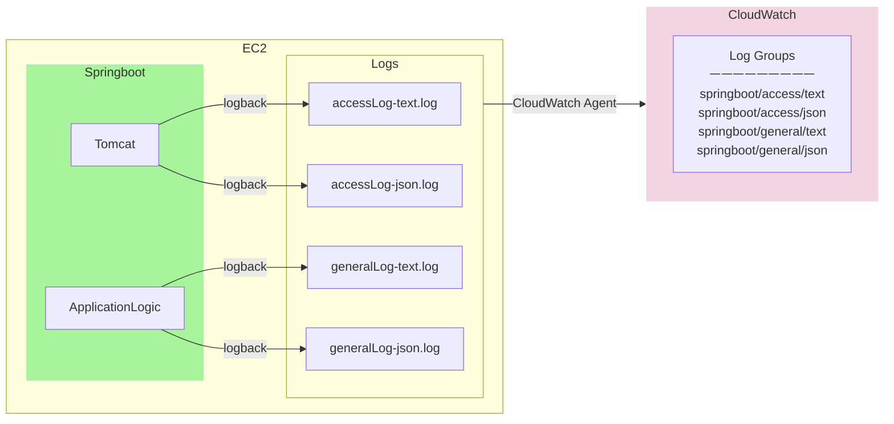

## 프로젝트 소개
- 소프트웨어 커리큘럼 등 개발자 취업 관련 정보 제공 서비스

 

## 기술 스택
- **TypeScript, React**, Webpack, Styled-components, React Query 
- **Java11, Spring Boot, Spring Data JPA**, Spring REST Docs, Logback, Mockito, Mockmvc, JUnit5
- AWS CodeDeploy, CloudWatch, EC2 (ALB, Auto Scaling), S3, RDS(Aurora), Secrets Manager

 

## 인프라
### HTTP 요청 처리 과정

### Frontend CI/CD

### Backend CI/CD

### CloudWatch 모니터링

 

## 주요 요청 처리 흐름

  
로그인 요청

  

    
엑세스 토큰 검증 및 재발급

    
    

 

## API 문서

- https://api.bootme.co.kr/docs/swagger/index.html
- https://api.bootme.co.kr/docs/rest/index.html

 
